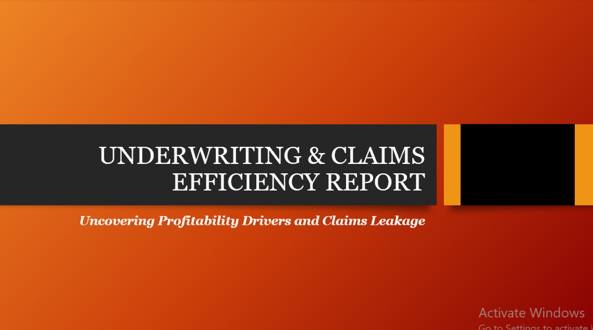
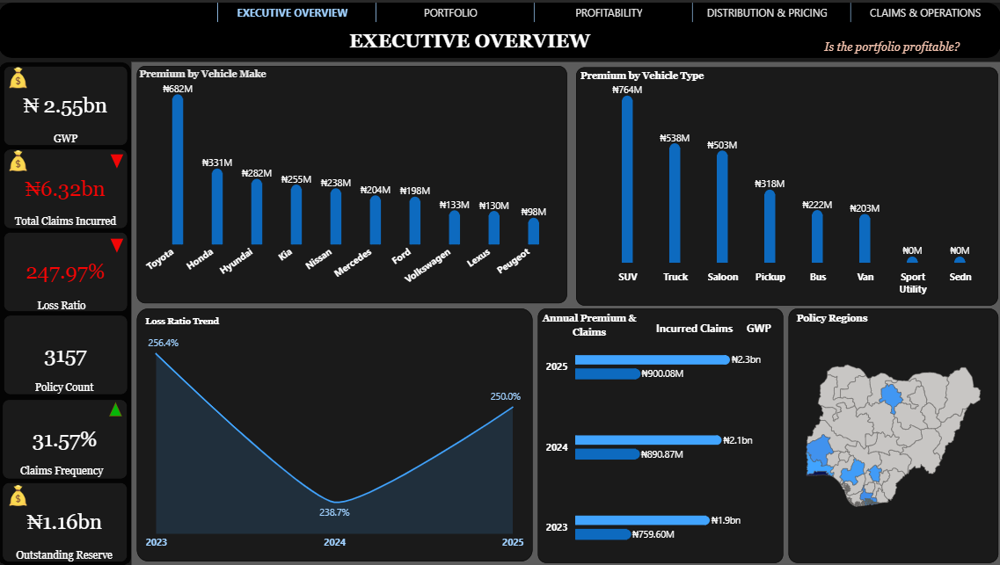
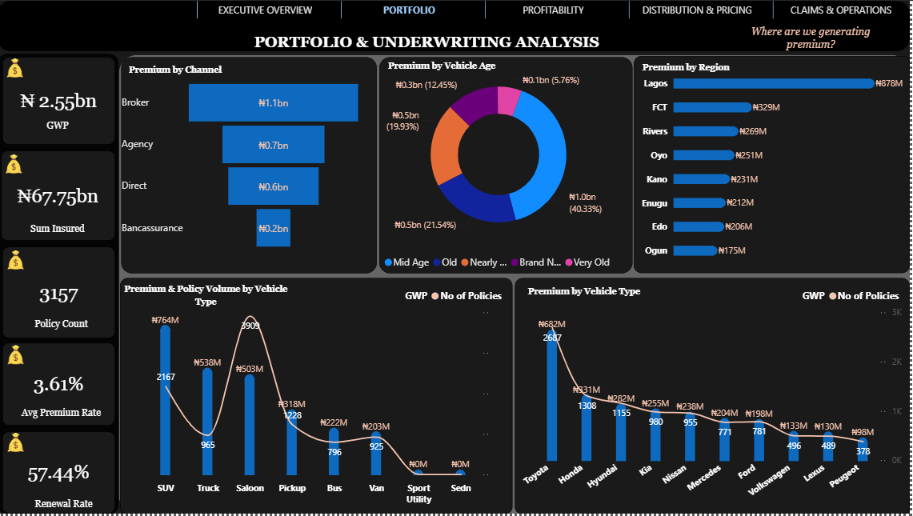
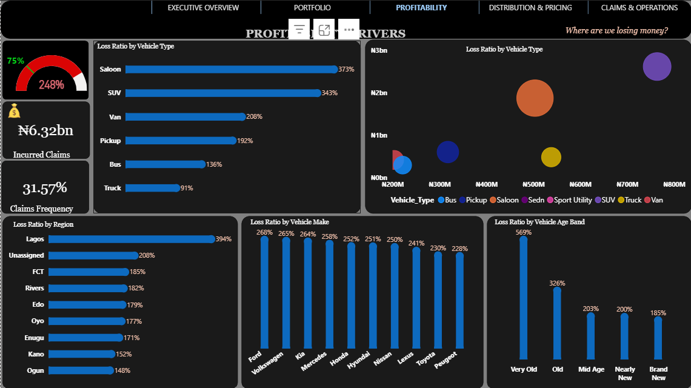
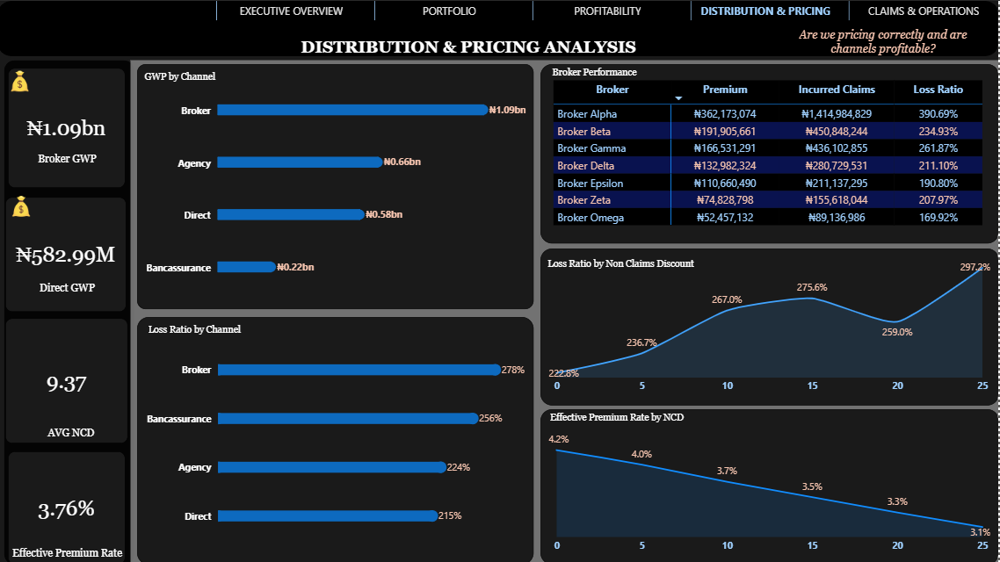
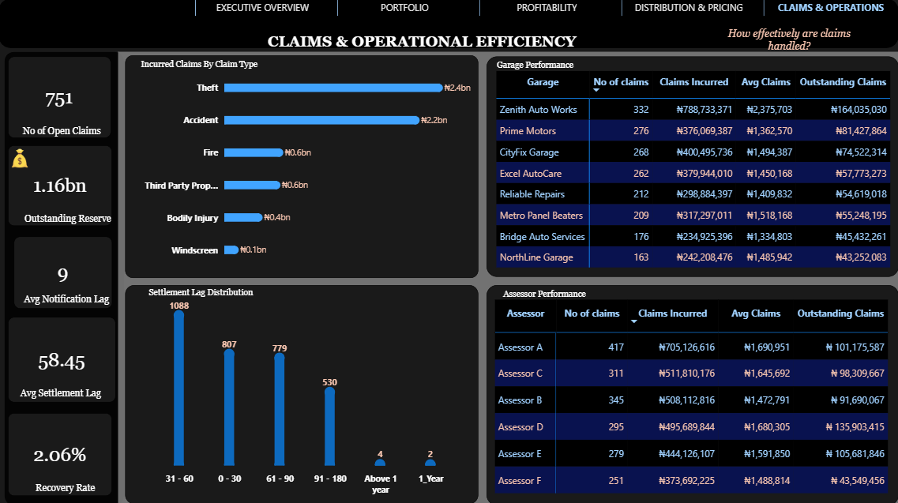

<div align="center">

# 🚗 Underwriting & Claims Efficiency Report
### Uncovering Profitability Drivers and Claims Leakage — A Motor Insurance Portfolio Deep-Dive

**A five-page Power BI solution built to answer one question leadership kept asking: is this portfolio actually profitable, and if not, where is the money going?**


<br>



<br><br>

**[📄 PDF Report](./documentation/Leadway_Assurance_Assessment_Dashboard.pdf)** · **[📊 PBIX File](./Underwriting_Claims_Dashboard.pbix)** · **[🖼️ Screenshots](./assets/screenshots/)** · **[✉️ Contact](#-about-the-author)**

</div>

<br>

---

## 📌 Executive Summary

For a motor insurance portfolio, profitability is a moving target that depends on how premium is priced, which channels write the business, which vehicles and regions generate the most claims, and how efficiently those claims get settled once they occur. Any one of those levers reported in isolation gives an incomplete — and often misleading — picture of portfolio health.

This project delivers a **five-page Power BI dashboard** built around a Nigerian motor insurance portfolio, structured to move from "is the portfolio profitable?" down to "where exactly are we losing money, and why?" The five pages — **Executive Overview, Portfolio & Underwriting, Profitability Drivers, Distribution & Pricing, and Claims & Operations** — form a deliberate analytical narrative: overview first, then underwriting mix, then loss drivers, then channel/pricing behavior, then the operational claims-handling detail that ultimately explains the numbers above it.

**Business value delivered:**
- A single, governed view of **Gross Written Premium (GWP), incurred claims, loss ratio, and outstanding reserves**
- Segment-level loss ratio breakdowns by **vehicle type, vehicle make, region, and vehicle age band** to pinpoint where the portfolio is losing money
- **Broker- and garage-level performance tracking**, surfacing which distribution partners and repair networks carry the most claims risk
- Claims-operations metrics — **notification lag, settlement lag, recovery rate** — that connect underwriting losses to operational efficiency

<br>

---

## 🎯 Business Challenge

Motor insurance underwriting sits on a knife's edge between premium adequacy and claims volatility. Without a consolidated analytical layer, insurers commonly face:

| Challenge | Business Impact |
|---|---|
| **Portfolio Profitability** | A headline loss ratio alone doesn't say *why* a book is unprofitable — leadership needs it broken down by vehicle, region, channel, and age band to act on it |
| **Claims Monitoring** | Claims leakage (theft, accident severity, settlement delays) is invisible until it has already eroded margin |
| **Provider/Garage Management** | Repair costs vary widely by garage; without performance tracking, high-cost or slow-settling garages go unmanaged |
| **Utilization & Frequency Tracking** | Claims frequency trends by segment are hard to isolate from raw claims logs |
| **Distribution & Pricing** | Broker-driven business often carries different loss profiles than direct or agency business — without channel-level loss ratios, pricing can't be tuned by channel |
| **Executive Reporting** | Manually recombining underwriting, claims, and operations data every reporting cycle is slow and delays corrective action |


<br>

---

## 🎯 Business Objectives

1. Consolidate premium, claims, policy, broker, and garage/assessor data into a single relational data model
2. Establish a governed, single definition of **GWP, Loss Ratio, Claims Frequency, and Outstanding Reserve** across the organization
3. Identify the vehicle types, makes, regions, and age bands driving the highest loss ratios
4. Evaluate distribution channel performance — **GWP, loss ratio, and pricing (NCD/effective premium rate)** — by channel and by individual broker
5. Track claims-operations efficiency, including **notification lag, settlement lag, and recovery rate**, and benchmark garage and assessor performance
6. Replace static, manually assembled underwriting reports with a real-time, interactive executive dashboard

<br>

---

## 🗂️ Dataset Overview

| Dataset | Description | Role in Model |
|---|---|---|
| **Policies** | Policy-level records — vehicle make/type/age, region, channel, sum insured, premium | Core dimension for portfolio and pricing analysis |
| **Claims** | Individual claim transactions — claim type, amount incurred, notification and settlement dates | Fact table driving loss ratio, frequency, and claims-operations metrics |
| **Vehicles** | Vehicle attributes — make, type, and age band | Dimension for loss-ratio segmentation |
| **Regions** | Nigerian states/regions where policies are written | Dimension for geographic loss-ratio and premium analysis |
| **Channels** | Distribution channels — Broker, Agency, Direct, Bancassurance | Dimension for channel-level GWP and loss-ratio analysis |
| **Brokers** | Individual broker performance — premium, incurred claims, loss ratio | Dimension for broker-level risk assessment |
| **Garages** | Repair garages handling claims — claim count, cost, outstanding claims | Dimension for claims-operations cost and efficiency analysis |
| **Assessors** | Claims assessors — claim volume, cost, and outstanding claims handled | Dimension for claims-handling performance tracking |
| **Date** | Calendar table for time intelligence | Enables annual and settlement-lag trend analysis |

<br>

---


## ⚙️ Technical Architecture

| Layer | Implementation |
|---|---|
| **Data Cleaning & Transformation** | Power Query used to standardize vehicle make/type categories, resolve region naming (including handling unassigned regions), and clean broker/garage identifiers |
| **Data Modeling** | Star schema with `Claims` and `Policies` as fact tables against shared dimensions |
| **DAX Measures** | Custom measure layer for GWP, Loss Ratio, Claims Frequency, Recovery Rate, Effective Premium Rate, and lag calculations |
| **KPI Cards** | Executive card visuals on every page (GWP, Loss Ratio, Outstanding Reserve, etc.) |
| **Interactive Filtering** | Cross-page consistent slicers and drill paths by channel, region, and vehicle segment |
| **Navigation** | Persistent top navigation bar linking all five report pages, each framed around a specific business question |
| **Time Intelligence** | Year-over-year loss ratio and premium trending (2023–2025) |
| **Performance Optimization** | Star schema design to keep the model efficient as policy and claims volume grows |

<br>

---

## 📊 Dashboard Walkthrough

<details open>
<summary><b>1️⃣ Executive Overview — "Is the portfolio profitable?"</b></summary>

<br>

**Purpose:** Give leadership an immediate read on overall portfolio profitability.

**Business Questions Answered:**
- What is our total premium, incurred claims, and loss ratio?
- How has the loss ratio trended over the last three years?
- Which vehicle makes and types generate the most premium?
- How is premium distributed geographically?

**Key KPIs:** GWP (₦2.55bn) · Total Claims Incurred (₦6.32bn) · Loss Ratio (247.97%) · Policy Count (3,157) · Claims Frequency (31.57%) · Outstanding Reserve (₦1.16bn)

**Visualizations Used:** KPI cards, premium by vehicle make bar chart, premium by vehicle type bar chart, three-year loss ratio trend line, annual premium & claims bar chart, policy regions map

**Business Value:** Immediately confirms the portfolio is running a loss ratio far above breakeven — a 247.97% loss ratio means claims incurred are running at roughly 2.5x premium, the single most important number on the entire dashboard.

<div align="center">

</div>

</details>

<details>
<summary><b>2️⃣ Portfolio & Underwriting Analysis — "Where are we generating premium?"</b></summary>

<br>

**Purpose:** Understand the composition of the book — where premium comes from and how the portfolio is structured.

**Business Questions Answered:**
- Which distribution channels generate the most premium?
- How is premium distributed by vehicle age, region, and type?
- What is our renewal rate and average premium rate?

**Key KPIs:** GWP (₦2.55bn) · Sum Insured (₦67.75bn) · Policy Count (3,157) · Average Premium Rate (3.61%) · Renewal Rate (57.44%)

**Visualizations Used:** Premium by channel bar chart, premium by vehicle age donut, premium by region bar chart, premium & policy volume by vehicle type combo chart, premium by vehicle make combo chart

**Business Value:** Shows the Broker channel as the dominant source of premium (₦1.1bn of the ₦2.55bn GWP) and Lagos as the leading region by a wide margin — both critical context for interpreting the loss-driver analysis on the next page.

<div align="center">

</div>

</details>

<details>
<summary><b>3️⃣ Profitability Drivers — "Where are we losing money?"</b></summary>

<br>

**Purpose:** Isolate exactly which segments are driving the portfolio's loss ratio.

**Business Questions Answered:**
- Which vehicle types, makes, regions, and age bands have the highest loss ratios?
- How does loss ratio relate to premium volume by vehicle type?

**Key KPIs:** Overall Loss Ratio (248%, against an implied target of 75%) · Incurred Claims (₦6.32bn) · Claims Frequency (31.57%)

**Visualizations Used:** Loss ratio gauge, loss ratio by vehicle type bar chart, loss ratio-by-region bar chart, loss ratio-by-vehicle-make bar chart, loss ratio-by-vehicle-age-band bar chart, premium-vs-loss-ratio bubble chart

**Business Value:** Pinpoints Saloon and SUV vehicle types, Lagos region, and "Very Old" vehicles as the most severe loss drivers — Very Old vehicles alone show a loss ratio of 569%, more than double the next-worst age band. This is the single most actionable page in the report for underwriting policy changes.

<div align="center">

</div>

</details>

<details>
<summary><b>4️⃣ Distribution & Pricing Analysis — "Are we pricing correctly, and are channels profitable?"</b></summary>

<br>

**Purpose:** Evaluate whether pricing (No-Claims Discount, effective premium rate) and channel performance are aligned with risk.

**Business Questions Answered:**
- Which channels generate the most GWP, and what is their loss ratio?
- How does loss ratio vary with No-Claims Discount (NCD) level?
- Which individual brokers are the best and worst performers?

**Key KPIs:** Broker GWP (₦1.09bn) · Direct GWP (₦582.99M) · Average NCD (9.37) · Effective Premium Rate (3.76%)

**Visualizations Used:** GWP by channel bar chart, loss ratio by channel bar chart, broker performance table (premium, incurred claims, loss ratio per broker), loss ratio by NCD line chart, effective premium rate by NCD line chart

**Business Value:** Broker Alpha alone shows a 390.69% loss ratio on ₦362M of premium — the single worst-performing broker in the book — while the Broker channel overall (278% loss ratio) underperforms every other channel, directly linking distribution strategy to the portfolio's profitability problem.

<div align="center">

</div>

</details>

<details>
<summary><b>5️⃣ Claims & Operational Efficiency — "How effectively are claims handled?"</b></summary>

<br>

**Purpose:** Connect the loss ratio story to the operational reality of how claims are processed.

**Business Questions Answered:**
- What claim types are driving the most cost?
- How quickly are claims notified and settled?
- Which garages and assessors are handling the most (and most expensive) claims?

**Key KPIs:** Open Claims (751) · Outstanding Reserve (₦1.16bn) · Average Notification Lag (9 days) · Average Settlement Lag (58.45 days) · Recovery Rate (2.06%)

**Visualizations Used:** Incurred claims by claim type bar chart, settlement lag distribution bar chart, garage performance table, assessor performance table

**Business Value:** Theft and Accident claims account for the large majority of incurred cost, and a recovery rate of just 2.06% signals almost no subrogation or salvage recovery is happening — a clear, quantified opportunity to improve claims recoveries and offset losses.

<div align="center">

</div>

</details>

<br>

---

## 📖 KPI Dictionary

| KPI | Definition |
|---|---|
| **GWP (Gross Written Premium)** | Total premium written across all policies before deductions |
| **Total Claims Incurred** | Total value of claims recognized as a cost to the insurer, whether paid or reserved |
| **Loss Ratio** | Total Claims Incurred divided by GWP (or Earned Premium) — the core measure of underwriting profitability; above 100% indicates claims exceed premium collected |
| **Claims Frequency** | The proportion of policies that generate at least one claim in the period |
| **Outstanding Reserve** | The estimated liability held against claims that are reported but not yet fully settled |
| **Sum Insured** | The total insured value across all policies — the maximum potential exposure |
| **Average Premium Rate** | Premium expressed as a percentage of sum insured — a pricing-adequacy indicator |
| **Renewal Rate** | The percentage of expiring policies that are renewed |
| **No-Claims Discount (NCD)** | A discount applied to premium based on a policyholder's claims-free history |
| **Effective Premium Rate** | The realized premium rate after applying NCD and other pricing adjustments |
| **Notification Lag** | The average time between a loss event occurring and the claim being reported |
| **Settlement Lag** | The average time between a claim being reported and it being fully settled |
| **Recovery Rate** | The percentage of claims cost recovered through subrogation, salvage, or other recovery mechanisms |

<br>

---

## 💡 Business Insights

- **The portfolio is running well past underwriting breakeven.** A 247.97% overall loss ratio means claims incurred are roughly 2.5x premium collected — this is the headline finding the entire report is built to explain.
- **Loss drivers are concentrated, not diffuse.** Saloon and SUV vehicle types, Lagos region, and "Very Old" vehicles each show loss ratios multiples above the portfolio average, meaning targeted underwriting action — rather than a blanket rate increase — could meaningfully improve the loss ratio.
- **Vehicle age is one of the strongest loss predictors in the book.** Loss ratio drops steadily and substantially from "Very Old" (569%) through "Brand New" (185%), a textbook underwriting signal for age-based pricing or eligibility rules.
- **The Broker channel is both the largest premium source and the worst-performing channel**, with a loss ratio well above Agency and Direct — suggesting broker-sourced business is being underpriced relative to its actual risk.
- **Performance varies sharply within the broker network itself.** Broker Alpha's loss ratio is more than double that of the best-performing brokers, meaning broker-level risk management (not just channel-level) is warranted.
- **Claims recovery is essentially untapped.** A 2.06% recovery rate against ₦6.32bn of incurred claims represents a significant, quantifiable opportunity to recapture cost through subrogation and salvage.
- **Settlement lag is heavily front-loaded but with a long tail.** Most claims settle within 90 days, but a small number stretch beyond a year — worth investigating as they likely carry disproportionate reserve and cost risk.

<br>

---

## 🧭 Strategic Recommendations

1. **Re-underwrite the highest-loss segments** — introduce tighter eligibility, higher deductibles, or targeted rate increases for Saloon/SUV vehicle types, Very Old vehicles, and Lagos-region risks.
2. **Reprice the Broker channel** — align broker commission structures and rating factors with the channel's demonstrably higher loss ratio relative to Agency and Direct.
3. **Manage broker relationships individually** — introduce broker-level loss-ratio thresholds and review or renegotiate terms with consistently underperforming brokers such as Broker Alpha.
4. **Invest in claims recovery capability** — build a dedicated subrogation/salvage function; even modest improvement in the 2.06% recovery rate would materially offset incurred losses.
5. **Tighten claims-settlement processes** — investigate the long-tail claims (settlement beyond 90 days) driving elevated average settlement lag, and standardize garage/assessor workflows around the fastest-performing benchmarks in the network.
6. **Optimize garage network management** — direct higher claim volumes toward garages with lower average claims cost and faster resolution, using the garage performance table as an ongoing scorecard.
7. **Refine NCD and pricing strategy** — the rising loss ratio alongside increasing NCD levels suggests the discount schedule may be outpacing the actual risk reduction it should reflect; revisit the NCD-to-risk relationship.
8. **Strengthen forecasting and reserving discipline** — given the scale of the outstanding reserve (₦1.16bn), build trend-based forecasting to anticipate reserve adequacy rather than reacting after the fact.

<br>

---

## 🛠️ Skills Demonstrated

| | |
|---|---|
| 📊 **Business Intelligence** | End-to-end BI solution spanning underwriting, distribution, and claims operations |
| ⚡ **Power BI** | Five-page executive dashboard with consistent narrative-driven navigation |
| 🧮 **DAX** | Custom measures for loss ratio, claims frequency, recovery rate, NCD, and lag calculations |
| 🔧 **Power Query** | Data cleaning and transformation across policy, claims, broker, and garage sources |
| 🗃️ **Data Modeling** | Star schema connecting underwriting and claims fact tables to shared dimensions |
| 🚗 **Insurance Analytics** | Loss ratio, GWP, NCD, and channel/broker performance analysis |
| 🏥 **Claims Operations Analytics** | Settlement lag, notification lag, garage, and assessor performance benchmarking |
| 📖 **Data Storytelling** | A deliberate page-by-page narrative moving from "is it profitable" to "why not" |
| 🧑‍💼 **Executive Reporting** | Designed for a non-technical, decision-making audience |
| 🎨 **Dashboard Design** | Clean, dark-themed, multi-page report UX with consistent navigation |

<br>

---

## 📁 Repository Structure

```
leadway-underwriting-claims-efficiency/
│
├── README.md
├── LICENSE
├── Leadway_Underwriting_Claims_Dashboard.pbix
│
├── documentation/
│   ├── Leadway_Assurance_Assessment_Dashboard.pdf
│   ├── Data_Dictionary.md
│   └── DAX_Measures.md
│
└── assets/
    └── screenshots/
        ├── cover-image.png
        ├── data-model.png
        ├── 01-executive-overview.png
        ├── 02-portfolio-underwriting.png
        ├── 03-profitability-drivers.png
        ├── 04-distribution-pricing.png
        └── 05-claims-operations.png
```

<br>

---

## 🚀 Future Improvements

- [ ] **Predictive Loss Ratio Modeling** — Forecast loss ratio by segment before renewal, rather than reviewing it retrospectively
- [ ] **Fraud Detection Layer** — Anomaly detection on claim type, garage, and assessor patterns to flag potential fraud
- [ ] **AI-Generated Executive Narratives** — Natural-language summaries of the month's biggest movers across loss ratio, channel, and region
- [ ] **Row-Level Security (RLS)** — Region- or broker-level access control for multi-stakeholder deployment
- [ ] **Incremental Refresh** — Optimize refresh performance as policy and claims history grows
- [ ] **Recovery & Subrogation Tracker** — A dedicated page monitoring recovery rate improvement initiatives over time

<br>

---

## 👤 About the Author

**Oluwasegun Shobowale**
*Business Intelligence Analyst · Healthcare & Insurance Analytics*

Oluwasegun designs and builds data analytics solutions and training curricula focused on healthcare and insurance domains, with hands-on expertise across SQL, Power BI, DAX, and data modeling. His work spans hospital operations analytics, HMO and motor insurance portfolio performance, and dimensional modeling for multi-country datasets — combining technical rigor with a consulting-style focus on business impact and clear communication.

[](https://github.com/oluwasegun-j)
[](https://www.linkedin.com/in/segunshobo/)
[](https://jumpy-dewberry-4b8.notion.site/Oluwasegun-Shobowale-2be03309cd84808dab84f16eb1dfeed0)
[](https://medlytics-insights.vercel.app/)

<br>

---

<div align="center">

*This project is part of a broader analytics portfolio spanning healthcare, insurance, and business intelligence.*

**⭐ If this project is useful, consider starring the repository.**

</div>
